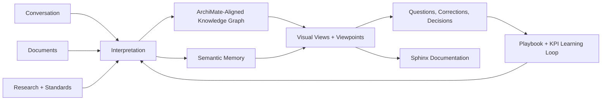
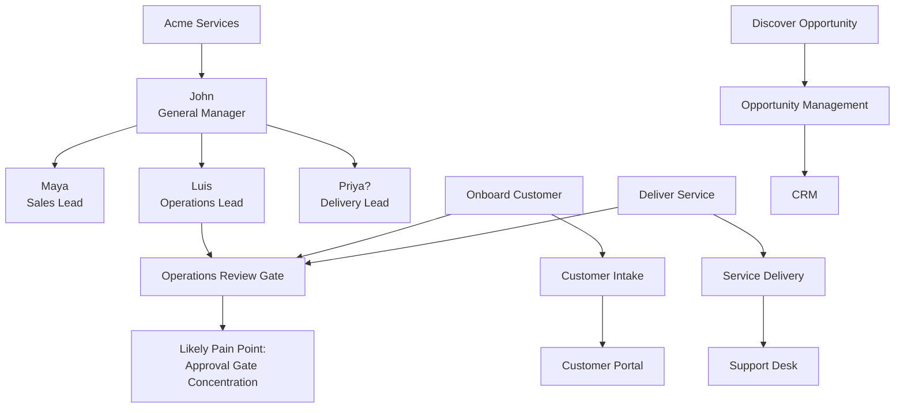
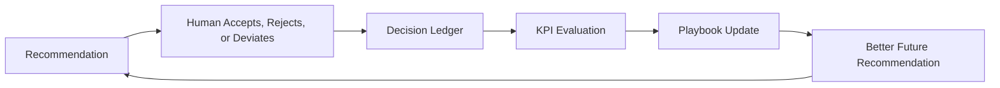
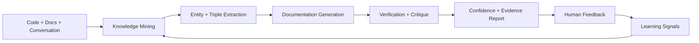

# Modeler

Modeler is a visual documentation portal for business architecture. It turns conversations, documents, research, and user feedback into ArchiMate-aligned knowledge that can be explored, questioned, measured, and published.

The product should feel like an architecture intern with a good notebook: it knows the standards, learns the organization, asks clarifying questions, records evidence, and improves its recommendations over time.

## The Experience We Are Building

Modeler is not just a document site and not just a diagramming tool. It is a living architecture workspace where visual navigation, standards-based modeling, and evidence-backed learning reinforce each other.



The first implementation should use a small fake organization so we can show the product's potential before depending on real organizational data quality.

## Product Promise

Modeler should help users answer architecture questions like:

- What value stream is this process part of?
- Who owns this gate?
- Which systems support this capability?
- Where are handoffs concentrated?
- What appears load-bearing?
- Which pain points are known, inferred, or merely suspected?
- What evidence supports this recommendation?
- What should we ask next to reduce uncertainty?

The answer should never be a lonely paragraph. It should include the relevant view, source evidence, confidence, standards alignment, open questions, and learning hooks.

## Signature Artifact: Dual-Lens Milky Way Map

The flagship view is a Milky Way-style enterprise map inspired by Eero Hosiaisluoma's enterprise design work. It should help users move between strategy, value, capability, process, people, systems, gates, and evidence without losing context.

The same knowledge graph should render through two primary lenses.

### Value Stream Lens

```text
                              Purpose / Outcomes
                    +-------------------------------------+
                    | Discover | Sell | Onboard | Deliver |
                    |----------+------+---------+---------|
Capabilities        | Market   | Deal | Intake  | Service |
Processes           | Qualify  | Quote| Validate| Fulfill |
People / Roles      | Maya     | Maya | Luis    | Priya   |
Systems             | CRM      | CRM  | Portal  | Desk    |
Gates / Evidence    | Review   | Sign | Ops OK  | Launch  |
Pain / Risk         | ?        |      | Delay   | Handoff |
                    +-------------------------------------+
```

In this lens, sectors are value stream stages. Departments, roles, systems, pain points, and confidence appear as overlays.

### Organization Lens

```text
                              Organization / Function
                    +-------------------------------------+
                    | Strategy | Sales | Operations | IT  |
                    |----------+-------+------------+-----|
Leaders             | John     | Maya  | Luis       | Ren |
Value Streams       | Improve  | Sell  | Onboard    | All |
Capabilities        | Planning | CRM   | Delivery   | App |
Processes           | Review   | Quote | Validate   | Fix |
Gates / Evidence    | Funding  | Deal  | Ops OK     | CAB |
Pain / Risk         | ?        | CRM   | Delay      | Load|
                    +-------------------------------------+
```

In this lens, sectors are functions or departments. Value streams appear as flows crossing the organization.

The user changes the lens, not the truth. The underlying model remains one connected graph.

## Knowledge Graph Shape

The early graph should stay intentionally small, flat, and understandable.



The MVP should make partial knowledge visible. Unknown reporting lines, unverified owners, inferred pain points, and missing evidence are part of the product, not defects to hide.

## Artifact Gallery

These are the artifact types Modeler should create, display, and improve.

### 1. Question Answer Card

```text
Question
Who reports to John?

Answer
Maya and Luis are verified direct reports.
Priya is associated with John's delivery gate, but the reporting relationship is unresolved.

Evidence
- Seed organization model: Maya reports to John.
- User correction: Luis reports to John.
- Inference: Priya owns delivery activity connected to John's gate.

Confidence
High for Maya and Luis.
Low for Priya.

Next Best Question
Should Priya be modeled as reporting to John, partnering with John, or owning a separate delivery function?
```

### 2. Collapsible Branch

```text
Before verification:

John
+-- Maya        verified
+-- Luis        verified
+-- Priya?      unresolved

After verification:

John [collapsed: 3 verified direct reports]
```

Collapsed branches should remain inspectable. A branch can reopen when new evidence conflicts with the collapsed summary.

### 3. Textbook Pain Point Card

```text
Pain Point
Approval gate concentration

Pattern
Multiple value stream stages depend on one operations approval gate.

Why It Matters
This may create queueing, unclear ownership, delayed value delivery, and hidden prioritization conflict.

Evidence
- Onboard Customer requires Operations Review.
- Deliver Service requires Operations Review.
- Resolve Exception requires Operations Review.

Confidence
Medium. Gate ownership is known, but volume and wait time are not modeled.

Recommended Next Question
How often does this gate block work for more than one business day?

Learning Hook
Track whether this pattern leads to accepted process changes, rejected assumptions, or a more specific diagnostic rule.
```

### 4. Research Source Card

```text
Source
Natural language to BPMN research paper

Topic
Conversational text to process model extraction

Status
Candidate source

Usefulness
May inform how Modeler maps user conversation into BPMN-aligned process structures.

Trust Boundary
This source can inform examples and experiments. It does not become a validation rule until reviewed.

Linked Playbook Decision
Prefer grounded extraction over unconstrained generation for the first interpreter.
```

### 5. Playbook Decision Ledger

```text
Decision
Start with fake generic organization data.

Rationale
Demonstrates visual traversal, uncertainty, and feedback loops before real document quality becomes the bottleneck.

Expected Outcome
Users understand the product potential in one local demo.

KPIs
- Time to first useful view
- Number of answerable graph questions
- Branch resolution rate
- User correction rate

Review Trigger
Revisit after the first end-to-end prototype.

Deviation Policy
Humans can introduce real documents earlier. Capture the reason and compare outcomes.
```

### 6. RL and KPI Scorecard

```text
Capability
Conversational text to ArchiMate viewpoint

What We Measure
- Mapping accuracy
- Relationship validity
- Viewpoint fit
- User correction rate
- Confidence calibration
- Reopened collapsed branches

Why
The system must improve at turning messy business language into useful architecture structures.

How
- Accepted and rejected mappings
- Corrected relationships
- Follow-up questions
- View traversal behavior
- Playbook deviations

Improvement Action
Prefer mappings and viewpoints that produce accepted answers with fewer corrections and better confidence calibration.
```

### 7. Generated Sphinx Page

```text
Customer Onboarding Value Stream
================================

Purpose
-------
Move a qualified customer from signed agreement to active service.

Stages
------
1. Intake customer details
2. Validate contract and compliance requirements
3. Configure delivery workspace
4. Confirm launch readiness

Capabilities
------------
- Customer intake management
- Compliance validation
- Service configuration
- Launch governance

Pain Points
-----------
- Operations Review gate appears in three separate stages.
- Ownership of exception handling is unresolved.

Evidence
--------
- Seed organization model
- User answer on reporting structure
- Playbook pattern: approval gate concentration
```

## MVP Demo World

The first product slice should use a fake organization like this:

```text
Acme Services

People
- John, General Manager
- Maya, Sales Lead
- Luis, Operations Lead
- Priya, Delivery Lead
- Ren, IT Lead

Value Streams
- Discover Opportunity
- Onboard Customer
- Deliver Service

Capabilities
- Opportunity management
- Customer intake
- Compliance validation
- Service configuration
- Exception handling

Systems
- CRM
- Customer Portal
- Delivery Workspace
- Support Desk

Known or Suspected Pain Points
- Repeated operations approval gate
- Unclear exception owner
- Manual handoff from sales to delivery
- Possible system dependency on CRM for too many stages
```

The demo world should be small enough to understand in one sitting but rich enough to show visual traversal, Q&A, evidence, collapse/expand, and feedback-driven improvement.

## Learning Loop

Modeler should measure its own decisions.



Examples:

- If users keep correcting reporting relationships, improve organization extraction prompts and confidence thresholds.
- If a pain point card is repeatedly rejected, revise or retire the diagnostic rule.
- If a research source leads to useful modeling decisions, promote it in the reviewed source library.
- If a collapsed branch is often reopened, make the collapse rule stricter.

## Documentation Quality Loop

Documentation is part of the learning system. Modeler should document the codebase, critique the documentation, grade the result, and present evidence before asking humans to trust it.



Documentation facts should be stored as auditable knowledge, not loose prose.

```text
Extracted Fact
Component: Visual Portal
Predicate: renders
Object: Milky Way Viewpoint

Evidence
- README artifact gallery
- Design spec visual portal layer
- Future source code reference, once implemented

Confidence
0.86

Validation
Supported by product docs.
Code evidence pending.

Feedback
Thumbs up/down, correction, or request for more evidence.
```

Quality checks should include:

- Coverage: important components, views, services, and decisions are documented.
- Traceability: documentation claims link to code, specs, conversations, or research.
- Freshness: docs reflect current implementation and recent decisions.
- Ambiguity: vague claims are flagged and rewritten or marked as assumptions.
- Standards alignment: architecture terms match ArchiMate, BPMN, UML/SysML, and local modeling rules.
- Evidence strength: generated claims expose confidence, source, and validation status.
- User usefulness: feedback captures whether the documentation answered the user's actual question.

Future documentation updates should meet or exceed the existing product-documentation bar. If an automated update lowers clarity, evidence, coverage, or usefulness, the critique layer should block or flag it before it is presented as trustworthy.

## Documentation Trust Boundary

Modeler should handle internal and external documents differently.

Internal documentation is learning material. Product docs, design specs, code comments, generated Sphinx pages, implementation notes, and architecture decisions can be mined, critiqued, corrected, and used to improve future documentation behavior because the team can inspect and repair them.

External documents are quality-controlled inputs or outputs, not automatic learning material. Customer documents, third-party standards, vendor references, regulatory guidance, uploaded files, and published deliverables should be processed with stricter trust and permission rules.

```text
Internal Document
Purpose: Learn and improve
Allowed: Mine, critique, correct, score, and feed back into the learning loop
Example: Product README, design spec, generated codebase docs

External Document
Purpose: Understand, transform, summarize, cite, or publish with high quality
Allowed: Extract auditable facts and confidence-scored claims for the task
Not Allowed: Use for model learning, playbook promotion, or future training unless a human explicitly approves
Example: Customer process manual, regulatory PDF, vendor architecture guide
```

Both document types can produce entity triples and evidence-backed claims, but each claim should carry a learning eligibility flag.

```text
Document Claim
Entity: Customer Onboarding Policy
Predicate: requires
Object: Operations Review Gate

Source Type
External customer document

Learning Eligibility
Do not learn by default

Use Allowed
Use for this analysis, cite as evidence, include in generated deliverable if permitted

Promotion Rule
Human approval required before this claim can become reusable organization knowledge or playbook evidence.
```

External document handling should emphasize:

- Permission: whether the document may be retained, cited, transformed, or used beyond the current task.
- Provenance: where the document came from and when it was accessed.
- Audience: whether the output is internal, customer-facing, regulatory, executive, or technical.
- Confidentiality: whether extracted facts should be redacted, isolated, or excluded from learning.
- Citation: whether claims must point back to source sections, pages, or passages.
- Freshness: whether the source may be stale or superseded.
- Promotion: whether a human has approved any extracted fact for reusable knowledge.

## Technology Direction

The prototype should run locally with Docker Compose.

```text
Portal UI        Visual navigation and artifact display
API              Orchestration, graph queries, AI boundary
RDF Store        Standards semantics, organization facts, validation rules
ChromaDB         Semantic memory over text, research, conversations, examples
Postgres         App state, review queues, job history, KPI snapshots
Redis            Cache, queues, scheduled work coordination
SearXNG          Research and standards search
Worker           Ingestion, extraction, evaluation, graph projection
Sphinx Renderer  Documentation generation
```

The stack is hybrid and RDF-first:

- RDF/OWL/SHACL is the backbone for standards, rules, provenance, and explainable facts.
- Chroma supports fuzzy retrieval over unstructured text and examples.
- Postgres stores ordinary application and workflow state.
- Redis coordinates fast temporary work.
- SearXNG keeps open research discovery available from day one.

## Source of Truth Boundaries

Modeler should preserve clear boundaries between kinds of knowledge.

| Knowledge Type | Purpose | Example |
| --- | --- | --- |
| Standards knowledge | Formal modeling backbone | ArchiMate relationship rules |
| Organization knowledge | Local facts and beliefs | Maya reports to John |
| Research knowledge | External evidence and candidate methods | Paper on text-to-BPMN extraction |
| Playbook knowledge | Recommended decisions and review history | Start with fake org data |
| Interaction knowledge | Feedback and behavior | User rejected a generated viewpoint |

This separation matters because the product must explain why it believes something, where the belief came from, and how strongly it should be trusted.

## Current Design Spec

The initial design lives in:

- [ArchiMate Visual Documentation Portal Design](docs/superpowers/specs/2026-08-16-archimate-visual-portal-design.md)

The next step is to turn the approved design into an implementation plan.
